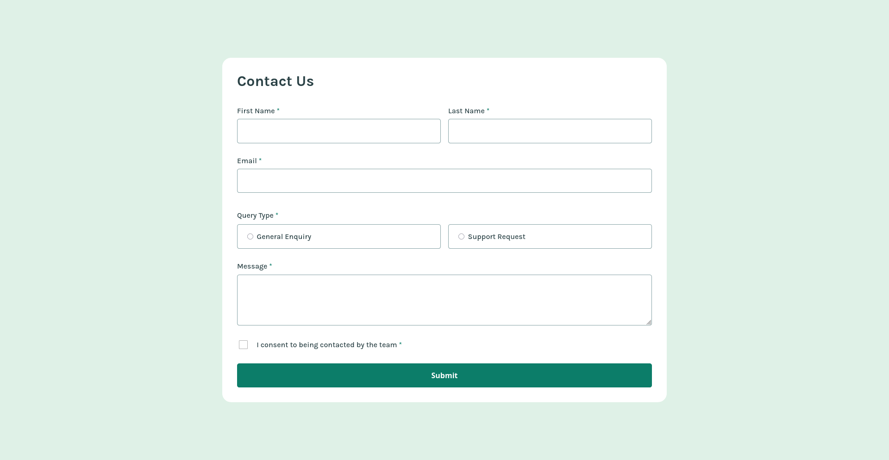

# Frontend Mentor - Contact form solution

This is a solution to the [Contact form challenge on Frontend Mentor](https://www.frontendmentor.io/challenges/contact-form--G-hYlqKJj). Frontend Mentor challenges help you improve your coding skills by building realistic projects. 

## Overview

### The challenge

Users should be able to:

- Complete the form and see a success toast message upon successful submission
- Receive form validation messages if:
  - A required field has been missed
  - The email address is not formatted correctly
- Complete the form only using their keyboard
- Have inputs, error messages, and the success message announced on their screen reader
- View the optimal layout for the interface depending on their device's screen size
- See hover and focus states for all interactive elements on the page

## Build

This project was built using:

- HTML5
- CSS3
- Javascript
- [React](https://reactjs.org/) - JS library
- Vite

## Future updates

As you can see, this is a frontend mentor challenge, maybe i'll send 2 or 3 small fix updates which i already notice what needs to be fixed.
please do not send pull requests, but feel free to create forks from this project and any issue you find on my code.

## Links

### This project

- This project its actually running on Vercel, which you can check and test [Here](https://contact-us-form-five.vercel.app/).
- Solution URL: [Contact us Form](https://github.com/GrIfFeR8282/Contact-Us-Form)
- Challenge link: [Contact Form](https://www.frontendmentor.io/challenges/contact-form--G-hYlqKJj)

### Author

- Frontend Mentor - [@GrIfFeR8282](https://www.frontendmentor.io/profile/GrIfFeR8282)
- Github: [@GrIfFeR8282](https://github.com/GrIfFeR8282)

